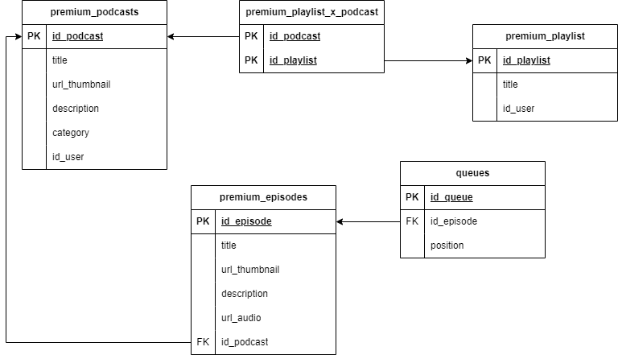

# REST SERVICE

## Deskripsi Singkat 
Web Service pada repository ini merupakan Web Service berbasis protokol REST yang menyediakan layanan tambahan untuk web php yang telah dibuat sebelumnya. Web Service ini memberikan layanan bagi pengguna dengan akses premium.

## Skema Basis Data 

## Endpoint API 
Berikut adalah endpoint yang dapat diakses untuk mengakses layanan dari service ini :
1. Post pada `http://localhost:3000/token/create` 
2. Post pada `http://localhost:3000/token/verify`
3. Post pada `http://localhost:3000/episode`
4. Post pada `http://localhost:3000/library` 
5. Post pada `http://localhost:3000/playlist/podcast/{podcastId}` 
6. Post pada `http://localhost:3000/podcast`
7. Post pada `http://localhost:3000/queue/podcast`
8. Post pada `http://localhost:3000/queue/forward`
9. Post pada `http://localhost:3000/queue/backward`
10. Post pada `http://localhost:3000/queue/episode`
11. Post pada `http://localhost:3000/seed`
12. Post pada `http://localhost:3000/subs/extend`
13. Put pada `http://localhost:3000/episode`
14. Put pada `http://localhost:3000/podcast`
15. Put pada `http://localhost:3000/profile`
16. Get pada `http://localhost:3000/episode/{episodeId}`
17. Get pada `http://localhost:3000/playlist/{playlistId}` 
18. Get pada `http://localhost:3000/library`
19. Get pada `http://localhost:3000/playlist/title/{playlistId}`
20. Get pada `http://localhost:3000/podcast/{podcastId}`
21. Get pada `http://localhost:3000/podcast/by-user/{userId}`
22. Get pada `http://localhost:3000/podcast/episode/{podcastId}`
23. Get pada `http://localhost:3000/profile`
24. Get pada `http://localhost:3000/queue`
25. Get pada `http://localhost:3000/queue/current`
26. Get pada `http://localhost:3000/queue/next`
27. Get pada `http://localhost:3000/queue/previous`
28. Get pada `http://localhost:3000/search/podcast`
29. Get pada `http://localhost:3000/search/episode`
30. Get pada `http://localhost:3000/subs/expired`

## Pembagian Tugas
| Task                      | NIM      | 
| --------------------------| ---------|
| Endpoint Queue | 13521149 |
| Endpoint Autentikasi | 13521149  |
| |  |
| |  |
| |  |
| |  |
| |  |
| |  |
| |  |
| |  |